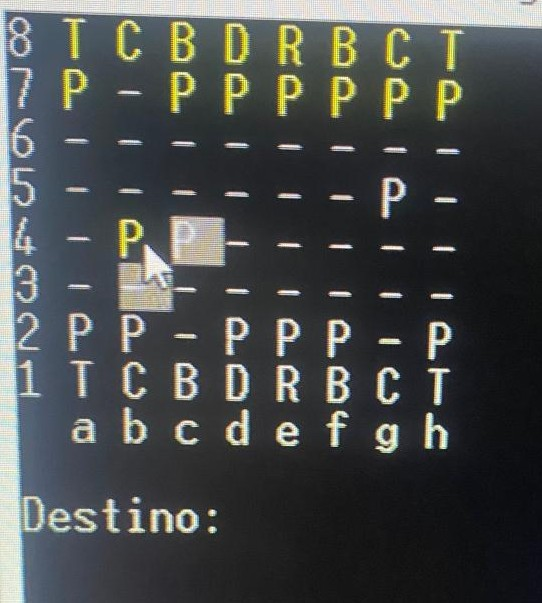

# Xadrez Console

Uma implementação em **C# .NET** de um jogo de **xadrez completo via console**. Permite jogar com peças reais, validar movimentos e detectar condições de vitória, xeque e xeque-mate.

## 📁 Estrutura do Projeto

Xadrez-Console
├── Properties/ # Configurações do projeto
├── tabuleiro/ # Classes responsáveis pelo tabuleiro e lógica
├── xadrez/ # Regras de jogo (peças, movimentos, status)
├── App.config # Configurações opcionais
├── Program.cs # Ponto de entrada (Main)
├── Tela.cs # Interface console (desenho de tabuleiro e input)
└── xadrez-console.csproj # Arquivo de projeto (.NET)

yaml
Copiar
Editar

---

## 🚀 Funcionalidades

- Representação completa do tabuleiro em texto.
- Movimentação válida de peças (rei, rainha, torre, cavalo, bispo e peão).
- Verificação de xeque e xeque-mate.
- Troca de promoção de peões.
- Alternância automática de turno entre as cores.

---

## 💻 Requisitos

- [.NET Core SDK 2.1](https://dotnet.microsoft.com/download/dotnet/2.1) (ou compatível)
- Visual Studio, Visual Studio Code, ou outro editor compatível com C#.